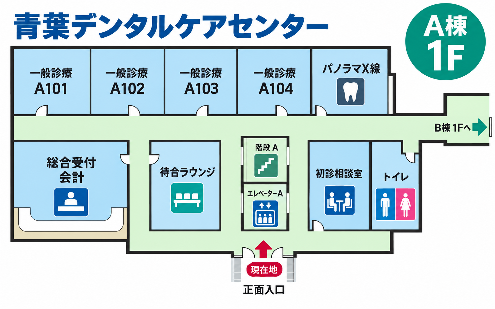
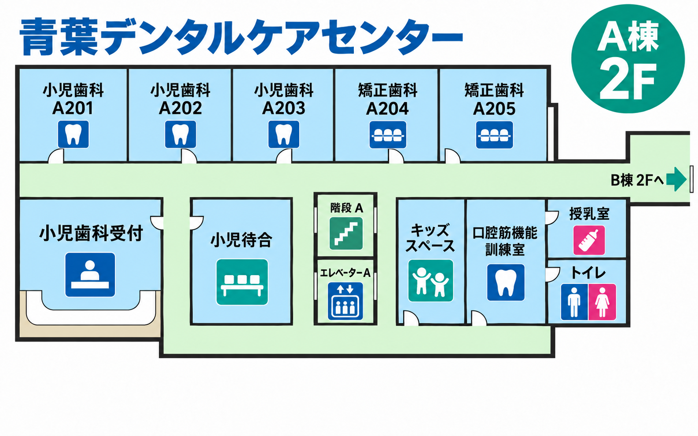
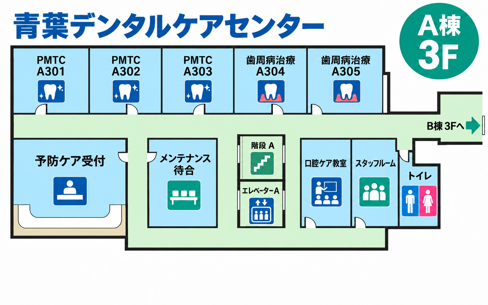
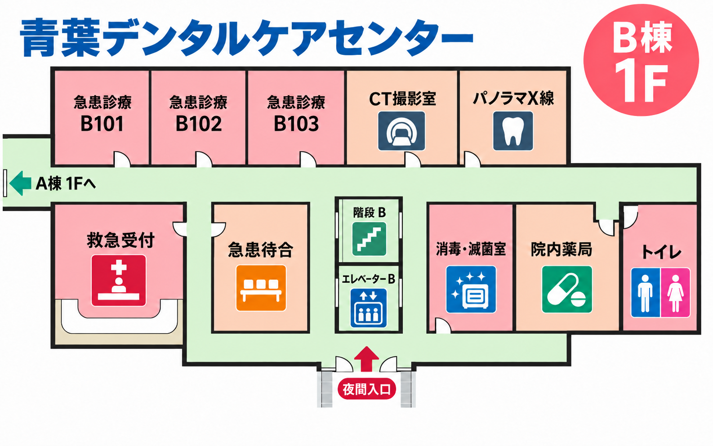
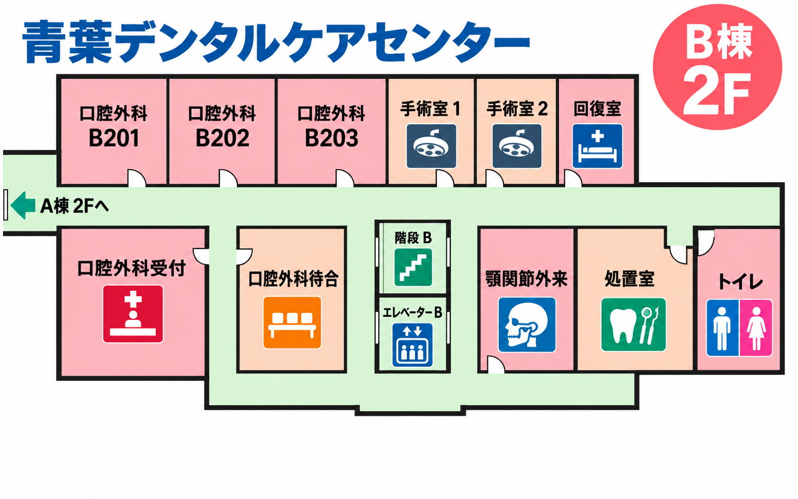
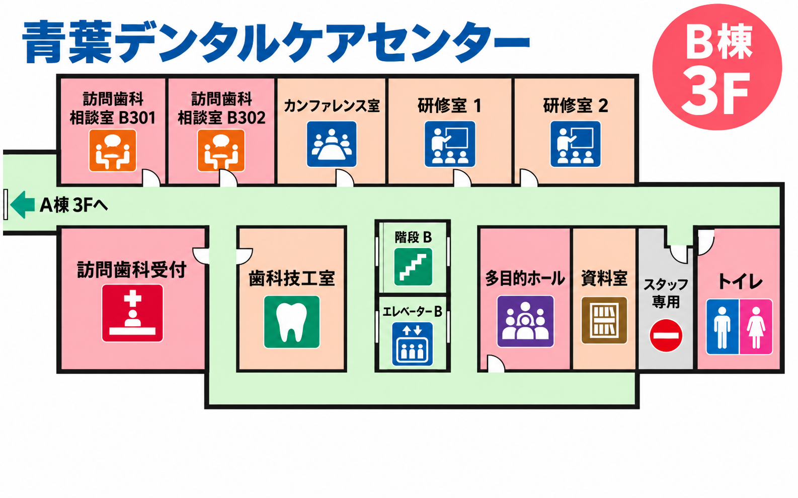

# 青葉デンタルケアセンター フロアマップ案内

> この資料に登場する医院・施設・部屋番号はすべて架空です。道案内システムのサンプルデータとして利用できます。

## 画像ファイル一覧

| 棟・階 | 主な診療機能 | ファイル名 | 相対パス |
|---|---|---|---|
| A棟 1F | 総合受付・一般診療・画像診断 | `a-building-1f.png` | `./maps/a-building-1f.png` |
| A棟 2F | 小児歯科・矯正歯科 | `a-building-2f.png` | `./maps/a-building-2f.png` |
| A棟 3F | 予防ケア・歯周病治療 | `a-building-3f.png` | `./maps/a-building-3f.png` |
| B棟 1F | 救急歯科・画像診断・院内薬局 | `b-building-1f.png` | `./maps/b-building-1f.png` |
| B棟 2F | 口腔外科・手術・回復 | `b-building-2f.png` | `./maps/b-building-2f.png` |
| B棟 3F | 訪問歯科・研修・歯科技工 | `b-building-3f.png` | `./maps/b-building-3f.png` |

## 共通の見方

- A棟は青〜青緑、B棟は珊瑚色〜桃色の室区画で表示しています。
- 薄い緑色の帯が共用廊下です。各診療室の扉はこの廊下に面しています。
- A棟の連絡通路は画像右端、B棟の連絡通路は画像左端にあり、同じ階どうしを結びます。
- 階段とエレベーターは各棟の中央付近にまとめています。上下階への案内はここを基準にしてください。
- 男女トイレは各階の画像右側です。
- 画像内の左右を使って案内するときは、地理的な東西ではなく「画像の右／左」と表現してください。

---

## A棟 1F — 総合受付・一般診療



### 施設一覧と用途

| 施設 | 用途 | 位置・目印 |
|---|---|---|
| 正面入口／現在地 | 一般来院者の入口 | 画像下中央。赤い「現在地」矢印が目印 |
| 総合受付・会計 | 初診受付、再来受付、会計 | 入口から入り、廊下を左へ進んだ先 |
| 待合ラウンジ | 診療前後の待機 | 入口の左前方、総合受付の右隣 |
| 初診相談室 | 初診時の相談と説明 | 入口の右前方、トイレの左隣 |
| 一般診療 A101〜A104 | 一般歯科診療 | 主廊下の上側に左から部屋番号順で並ぶ |
| パノラマX線 | 口腔全体のX線撮影 | A104の右隣、主廊下の上側 |
| 階段 A／エレベーター A | A棟内の上下階移動 | 主廊下の中央。階段が上、エレベーターが下 |
| トイレ | 男女トイレ | 画像右下、初診相談室の右隣 |
| B棟 1Fへの連絡通路 | B棟への水平移動 | 主廊下を右端まで進んだ先。緑色の右向き矢印 |

### 道案内に使える位置関係

- 正面入口から総合受付へ：入口から直進して主廊下に入り、左折。待合ラウンジを通り過ぎると総合受付です。
- 正面入口から一般診療室へ：入口正面の階段・エレベーターを目印に主廊下へ出て、各室番号の方向へ進みます。A101が最も左、A104が最も右です。
- 正面入口からパノラマX線へ：主廊下を右へ進み、A104の次の部屋です。
- A棟からB棟へ：主廊下を画像右端まで進み、「B棟 1Fへ」の矢印に従います。

---

## A棟 2F — 小児歯科・矯正歯科



### 施設一覧と用途

| 施設 | 用途 | 位置・目印 |
|---|---|---|
| 小児歯科受付 | 小児・矯正部門の受付 | 画像左下。受付アイコンが目印 |
| 小児待合 | 小児患者と家族の待機 | 受付の右隣 |
| 小児歯科 A201〜A203 | 小児歯科診療 | 主廊下の上側、画像左からA201・A202・A203の順 |
| 矯正歯科 A204〜A205 | 矯正相談と処置 | A203の右側、画像上段 |
| キッズスペース | 子どもの待機・遊び場 | 画像右下、子ども2人のアイコンが目印 |
| 口腔筋機能訓練室 | 口腔周囲筋の訓練・指導 | キッズスペースの右隣 |
| 授乳室 | 授乳・乳幼児ケア | 画像右上、哺乳瓶アイコンが目印 |
| 階段 A／エレベーター A | A棟内の上下階移動 | 主廊下中央 |
| トイレ | 男女トイレ | 画像右下、授乳室の下 |
| B棟 2Fへの連絡通路 | B棟への水平移動 | 主廊下の右端 |

### 道案内に使える位置関係

- 階段・エレベーターから小児歯科受付へ：主廊下に出て左へ進み、小児待合を通り過ぎた先です。
- 階段・エレベーターから診療室へ：主廊下上側の部屋番号を確認します。A201〜A203は左側、A204〜A205は右側です。
- キッズスペース、訓練室、授乳室、トイレは主廊下の右側にまとまっています。
- B棟へ：主廊下を画像右端まで進み、「B棟 2Fへ」の矢印に従います。

---

## A棟 3F — 予防ケア・歯周病治療



### 施設一覧と用途

| 施設 | 用途 | 位置・目印 |
|---|---|---|
| 予防ケア受付 | 定期検診・予防処置の受付 | 画像左下 |
| メンテナンス待合 | 予防処置前後の待機 | 受付の右隣 |
| PMTC A301〜A303 | 専門的な歯面清掃 | 主廊下の上側、画像左から部屋番号順 |
| 歯周病治療 A304〜A305 | 歯周病の検査と治療 | A303の右側、画像上段 |
| 口腔ケア教室 | ブラッシング指導・集団説明 | 画像右下、講義アイコンが目印 |
| スタッフルーム | 職員用 | 口腔ケア教室の右隣 |
| 階段 A／エレベーター A | A棟内の上下階移動 | 主廊下中央 |
| トイレ | 男女トイレ | 画像右下、スタッフルームの右隣 |
| B棟 3Fへの連絡通路 | B棟への水平移動 | 主廊下の右端 |

### 道案内に使える位置関係

- 階段・エレベーターから予防ケア受付へ：主廊下に出て左へ進み、メンテナンス待合の先です。
- PMTC室は主廊下上側の左からA301・A302・A303の順です。
- 歯周病治療室はPMTC室の並びを右へ進んだA304・A305です。
- 口腔ケア教室、スタッフルーム、トイレは主廊下の右側に並びます。
- B棟へ：主廊下を画像右端まで進み、「B棟 3Fへ」の矢印に従います。

---

## B棟 1F — 救急歯科・画像診断



### 施設一覧と用途

| 施設 | 用途 | 位置・目印 |
|---|---|---|
| 夜間入口 | 夜間・急患利用者の入口 | 画像下中央。赤い矢印と「夜間入口」が目印 |
| 救急受付 | 急患の受付 | 入口から主廊下へ進んで左側 |
| 急患待合 | 急患患者の待機 | 入口の左前方、救急受付の右隣 |
| 急患診療 B101〜B103 | 急患の診察・処置 | 主廊下の上側、画像左から部屋番号順 |
| CT撮影室 | 歯科用CT撮影 | B103の右隣 |
| パノラマX線 | 口腔全体のX線撮影 | CT撮影室の右隣 |
| 消毒・滅菌室 | 器材の洗浄・消毒・滅菌 | 画像右下、滅菌器アイコンが目印 |
| 院内薬局 | 処方薬の受け取り | 消毒・滅菌室の右隣 |
| 階段 B／エレベーター B | B棟内の上下階移動 | 主廊下中央 |
| トイレ | 男女トイレ | 画像右下、院内薬局の右隣 |
| A棟 1Fへの連絡通路 | A棟への水平移動 | 主廊下の左端。緑色の左向き矢印 |

### 道案内に使える位置関係

- 夜間入口から救急受付へ：入口から直進して主廊下に入り、左へ進みます。急患待合の先が受付です。
- 夜間入口から急患診療室へ：階段・エレベーターを基準に主廊下上側を確認します。B101〜B103は画像左側に番号順で並びます。
- CT・パノラマX線へ：急患診療室の並びを画像右へ進みます。先にCT、その次がパノラマX線です。
- A棟へ：主廊下を画像左端まで進み、「A棟 1Fへ」の矢印に従います。

---

## B棟 2F — 口腔外科・手術



### 施設一覧と用途

| 施設 | 用途 | 位置・目印 |
|---|---|---|
| 口腔外科受付 | 口腔外科の受付 | 画像左下 |
| 口腔外科待合 | 診察・手術前の待機 | 受付の右隣 |
| 口腔外科 B201〜B203 | 口腔外科診察・処置 | 主廊下の上側、画像左から部屋番号順 |
| 手術室 1・2 | 口腔外科手術 | B203の右側、画像上段 |
| 回復室 | 手術後の経過観察 | 手術室2の右隣 |
| 顎関節外来 | 顎関節症の診察 | 画像右下、頭部アイコンが目印 |
| 処置室 | 外科処置・処置後ケア | 顎関節外来の右隣 |
| 階段 B／エレベーター B | B棟内の上下階移動 | 主廊下中央 |
| トイレ | 男女トイレ | 画像右下、処置室の右隣 |
| A棟 2Fへの連絡通路 | A棟への水平移動 | 主廊下の左端 |

### 道案内に使える位置関係

- 階段・エレベーターから口腔外科受付へ：主廊下に出て左へ進み、口腔外科待合の先です。
- 診療室は主廊下上側の左からB201・B202・B203の順です。
- 手術室と回復室は診療室の並びを画像右へ進んだ先にあります。
- 顎関節外来、処置室、トイレは主廊下の右側に並びます。
- A棟へ：主廊下を画像左端まで進み、「A棟 2Fへ」の矢印に従います。

---

## B棟 3F — 訪問歯科・研修



### 施設一覧と用途

| 施設 | 用途 | 位置・目印 |
|---|---|---|
| 訪問歯科受付 | 訪問診療の相談・手続き | 画像左下 |
| 訪問歯科相談室 B301〜B302 | 訪問診療の個別相談 | 主廊下の上側、画像左から部屋番号順 |
| カンファレンス室 | 症例検討・打ち合わせ | B302の右隣 |
| 研修室 1・2 | 院内研修・講習 | カンファレンス室の右側、画像上段 |
| 歯科技工室 | 補綴物などの製作・調整 | 画像左下、歯のアイコンが目印 |
| 多目的ホール | 説明会・研修・地域向け催事 | 画像右下、複数人のアイコンが目印 |
| 資料室 | 研修資料・記録の保管 | 多目的ホールの右隣 |
| スタッフ専用区画 | 職員のみ通行可能な区域 | 資料室とトイレの間、進入禁止マークが目印 |
| 階段 B／エレベーター B | B棟内の上下階移動 | 主廊下中央 |
| トイレ | 男女トイレ | 画像右下 |
| A棟 3Fへの連絡通路 | A棟への水平移動 | 主廊下の左端 |

### 道案内に使える位置関係

- 階段・エレベーターから訪問歯科受付へ：主廊下に出て左へ進み、歯科技工室を通り過ぎた先です。
- 訪問歯科相談室は主廊下上側の左からB301・B302の順です。
- カンファレンス室と研修室は相談室の並びを画像右へ進んだ先です。
- 多目的ホールと資料室は階段・エレベーターの右側です。トイレへ向かう途中にスタッフ専用区画があるため、進入禁止表示に注意してください。
- A棟へ：主廊下を画像左端まで進み、「A棟 3Fへ」の矢印に従います。

## 画像を使った回答例

道案内への回答では、該当画像の相対パスを併記してください。

```markdown
小児歯科受付はA棟2Fです。階段またはエレベーターを降りたら、主廊下を画像の左へ進み、小児待合を通り過ぎてください。


```

## 制作情報

- 形式：PNG（6枚）＋Markdown（本ファイル）
- 画像サイズ：1586 × 992 px
- 想定用途：チャットでの院内道案内、デモ、検索用ナレッジベース
- 制作方式：参照画像の配色・区画表現を踏まえ、OpenAIの画像生成機能で作成し、案内上の不整合を調整
